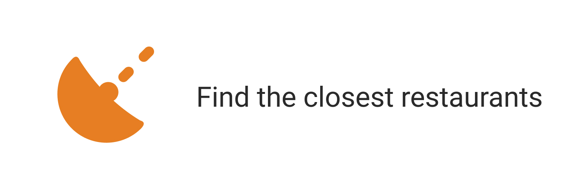

     

# Restaurant App


## Submission 1
- [x] Navbar
- [x] Hero
- [x] Cards
- [x] Footer
- [x] Skip to Content
- [x] Favicon
- [x] Rendering cards
- [x] Functional with the keyboard
- [x] ***build*** ok

### Saran Submission 1
- [x] Pada tag `<a>` tambahkan atribut rel="noopener" atau rel="noreferrer". Hal ini bertujuan dapat improve performa website
- [x] Sebaiknya element image restoran yang kamu tampilkan pada halaman home diberi ukuran(width dan height) yang sama agar lebih rapi dan seragam.

	```css
		width: 100%;
		height: 270px;
		object-fit: cover;
		object-position: center;
	```

- [x] Memanfaatkan plugin `favicons-webpack-plugin` untuk meload favicon.
- [x] Tambahkan meta tag Description pada berkas html.
- [x] Cobalah membuat Web Components pada beberapa komponen UI yang bersifat Reusable.
- [x] Perhatikan _style guide_ dan gunakan ***Linter***


## Submission 2
### Feature
- [ ] ~Our Story~
- [ ] ~Subscribe News Letter (promo)~
- [x] Fetch Data
- [x] Restructure AppBar
- [x] Buat Halaman `[Home, detail, fav]` => malam tgl 1
- [x] Buat komponen `hero-app` dan `card` => malam tgl 1
- [x] Config esLint 
- [x] using _ / underscore character

### Req
- [x] ESLint => tgl 1
- [x] Appshell
- [x] `manifest.json`
- [x] Service Worker  => tgl 1
- [x] Routes
- [x] Cache
- [x] IndexedDB
- [ ]  ~WebSocket dan Notification~

### Saran Submission 2
- [x] Menggunakan icon berukuran **512px** untuk splash screen.
- [x] Icons pada _manifest.json_ sebaiknya mempunyai properti purpose dengan **value maskable** atau **any maskable**. Gunakan tool pada [maskable editor](https://maskable.app/editor).


- [x] Atur jarak antar item.

- [x] Cobalah untuk mengimplementasikan fitur add customer review pada aplikasi kamu agar lebih interaktif. Referensi tambahan bisa dilihat di [add review](https://googlechrome.github.io/samples/fetch-api/fetch-post.html).

- [x] Kamu juga bisa memanfaatkan plugin `workbox-webpack-plugin` untuk membuat service worker menggunakan workbox dengan webpack. Referensi [workbox plugin](https://developers.google.com/web/tools/workbox/guides/codelabs/webpack).

- [x] Lakukan fiksasi otomatis dengan command `npx eslint ./src --fix` .

- [x] Sebaiknya tambahkan indikator loading atau skeleton ui ketika web app kamu sedang memuat data dari API.  Untuk skeleton UI, kamu bisa lihat pada artikel berikut : [skeleton screen](https://css-tricks.com/building-skeleton-screens-css-custom-properties/).

- [x] Sebaiknya tampilkan juga error ketika web app gagal memuat data dari API.

## Submissin 3
### Req or features
1. ~~**Integration Test**~~
	
	Syarat:
	- [x] ~~Menerapkan integration test untuk fungsi menyukai dan batal menyukai restoran. Referensi [Menyukai Film dari Dicoding](https://www.dicoding.com/academies/219/tutorials/9849?from=9844).~~


2. ~~**End to End Test**~~

	Syarat:
	- [x] ~~Menerapkan [End to End Test](https://www.dicoding.com/academies/219/tutorials/9959?from=9955) dengan skenario:~~
	- [x] ~~Menyukai salah satu restoran.~~
	- [x] ~~Batal menyukai restoran tersebut.~~


3. ~~**Image Optimization**~~

	Syarat:
	- [x] ~~Melakukan kompresi terhadap gambar hero yang digunakan. Ukuran gambar harus di bawah 200kb.~~
	- [x] ~~Menerapkan teknik image responsive pada gambar hero. Gambar pada layar seluler dan desktop harus berbeda.~~
	- [x] ~~Menerapkan teknik lazy loading pada gambar daftar restoran yang ditampilkan.~~


4. ~~**Bundle Optimization**~~

	Syarat:
	- [x] ~~Memasang bundle analyzer pada proyek submission.~~
	- [x] ~~Gunakan teknik Code Splitting untuk memisahkan vendor code dari kode asli yang Anda tuliskan.~~


5. **Pertahankan syarat yang ada pada submission sebelumnya**. Seperti penerapan PWA, responsibilitas tampilan, dan aksesibilitas pada website.
